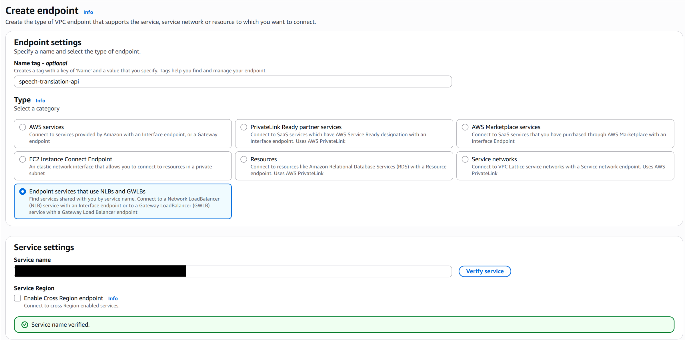
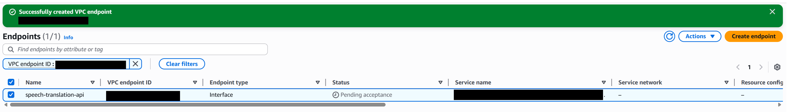
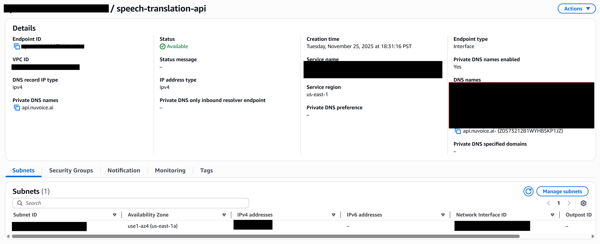

# AWS Setup

Setting up the Speech Translation API requires you to add an _interface endpoint_ in your AWS account.
An interface endpoint provides a private connection between your VPC and our service (the API).
This can be done either using the UI or the command line. 

### Pre-requisites

Before you can perform the steps you will need a service name which will be provided by us.

You can also provision a private VPC from where you will connect to the service. A private VPC can be provisioned by running following commands as example:

Step 1: Create VPC (example):

```
aws ec2 create-vpc --cidr-block "10.3.0.0/25" --no-amazon-provided-ipv6-cidr-block
```

Note down the VPC ID as you will need it in the next step. **Please provision the VPC in the same region as the service.**

Step 2: Create a security group:

```
aws ec2 create-security-group --group-name "consumer-sg" --description "Security group for service consumers" --vpc-id <INSERT-FROM-ABOVE>
```

Add inbound and outbound rules to the security group using the CLI or the UI.

Step 3: Create subnet(s) from where you will access the service (change `us-east-1a` to any other availability zone as appropriate):

```
aws ec2 create-subnet --availability-zone "us-east-1a" --cidr-block "10.0.0.0/27" --vpc-id <INSERT-FROM-ABOVE> --region us-east-1
```

In next section we cover how to create the interface endpoint.

### Using the UI

The steps to do this are documented on AWS [here](https://docs.aws.amazon.com/vpc/latest/privatelink/create-interface-endpoint.html#create-interface-endpoint-aws) and copied below for reference. Note the highlighted **_tweaks_** you must perform:

Open the Amazon `VPC` console at https://console.aws.amazon.com/vpc/.

In the navigation pane, choose `Endpoints`.

Choose `Create endpoint`.

For Type, choose **Endpoint services that use NLBs and GWLBs** (last option).

(Optional) If creating an endpoint to an AWS service in another Region, select the Enable cross Region endpoint checkbox and then select the service region from the drop down.

For Service name, **enter the service name provided to you by us**. Click on **Verify service**.



For VPC, select the VPC from which you'll access the AWS service. Provision a new VPC if you like.

**Uncheck Enable Private DNS**. This feature does not work while creating the endpoint. You can turn it on _after creating the endpoint by going to `Actions` -> `Modify private DNS Name`_.

For Subnets, select the subnets from which you will access the API. You can select one subnet per Availability Zone. You can't select multiple subnets from the same Availability Zone. For more information, see Subnets and Availability Zones. _You must select at least one subnet_.

By default, we select IP addresses from the subnet IP address ranges and assign them to the endpoint network interfaces. To choose the IP addresses yourself, select Designate IP addresses. Note that the first four IP addresses and the last IP address in a subnet CIDR block are reserved for internal use, so you can't specify them for your endpoint network interfaces.

For IP address type, choose from the following options:

IPv4 – Assign IPv4 addresses to the endpoint network interfaces. This option is supported only if all selected subnets have IPv4 address ranges and the service accepts IPv4 requests.

IPv6 – Assign IPv6 addresses to the endpoint network interfaces. This option is supported only if all selected subnets are IPv6 only subnets and the service accepts IPv6 requests.

Dualstack – Assign both IPv4 and IPv6 addresses to the endpoint network interfaces. This option is supported only if all selected subnets have both IPv4 and IPv6 address ranges and the service accepts both IPv4 and IPv6 requests.

For Security groups, select the security groups to associate with the endpoint network interfaces. By default, we associate the default security group for the VPC.

For Policy, to allow all operations by all principals on all resources over the interface endpoint, select Full access. To restrict access, select Custom and enter a policy. This option is available only if the service supports VPC endpoint policies. For more information, see Endpoint policies.

(Optional) To add a tag, choose Add new tag and enter the tag key and the tag value.

Choose `Create endpoint`.

This will create an endpoint and send us a request to approve it.



_Wait for the request to be approved before proceeding to the next section._

Below is example of a successfully created Endpoint. Note the Endpoint type is **interface**.



### Using the command-line

To create an interface endpoint using the command line refer [create-vpc-endpoint (AWS CLI)](https://docs.aws.amazon.com/cli/latest/reference/ec2/create-vpc-endpoint.html).

Example:

```bash
aws ec2 create-vpc-endpoint \
  --vpc-endpoint-type Interface \
  --vpc-id <your-vpc-id> \
  --service-name <service-name-provided-by-us> \
  --subnet-ids <subnet-id-1> <subnet-id-2> ... \
  --security-group-ids <sg-id-1> <sg-id-2> ...
```

Parameter explanations

* **`--vpc-endpoint-type Interface`**
  Must be `Interface`. This creates one or more elastic network interfaces (ENIs) inside *your* VPC that connect to our service.

* **`--vpc-id <your-vpc-id>`**
  The VPC **in your account** from which you want to connect to our service.

  * Typically a **private VPC** (no public IPs on your workloads).
  * If you don’t already have a suitable VPC, you may need to create one first.

* **`--service-name <service-name-provided-by-us>`**
  The name of our VPC endpoint service that you are connecting to.

  * We will provide this value (it usually looks like:
    `com.amazonaws.vpce.<region>.vpce-svc-xxxxxxxxxxxxxxx`).

* **`--subnet-ids <subnet-id-1> <subnet-id-2> ...`**
  One or more **subnets in your VPC** from where you will access the service. An endpoint network interface will be created in each subnet.

  * At least **one subnet** is required.
  * Subnets are **not** the same as Availability Zones (AZs), but each subnet belongs to exactly one AZ.  

* **`--security-group-ids <sg-id-1> <sg-id-2> ...`**
  One or more **security groups attached to the endpoint ENIs**. These control inbound and outbound traffic **to the endpoint**, not to the entire subnet.

  * You can specify multiple security groups; their rules are effectively combined.
  * Make sure they allow:

    * **Inbound**: traffic from your client resources (EC2, containers etc.) on the port/protocol used by our service i.e., traffic from EC2 → to the ENI
    * **Outbound**: generally allowed by default (“allow all outbound” is fine).
  * If you cannot connect to the service, its most likely due to a misconfigured security group.

Below is a complete example you can adapt. Replace the placeholder values with your own:

```bash
aws ec2 create-vpc-endpoint \
  --vpc-endpoint-type Interface \
  --vpc-id vpc-0123456789abcdef0 \
  --service-name com.amazonaws.vpce.us-east-1.vpce-svc-0abc123def4567890 \
  --subnet-ids subnet-0aaa111bbb222ccc1 subnet-0ddd222eee333fff2 \
  --security-group-ids sg-0123abcd4567efgh1
```

In this example:

* The endpoint is created in VPC `vpc-0123456789abcdef0`.
* Two subnets are used (in two different AZs) to provide high availability.
* Security group `sg-0123abcd4567efgh1` should:

  * Allow inbound traffic from your application instances on the required port (e.g., TCP 443).
  * Optionally keep the default “allow all outbound” rule (recommended).

You can then verify the endpoint status with:

```bash
aws ec2 describe-vpc-endpoints --vpc-endpoint-ids <created-endpoint-id>
```

### Making changes to existing endpoint

To configure an existing interface endpoint refer [this](https://docs.aws.amazon.com/vpc/latest/privatelink/interface-endpoints.html) guide.

## Test

To test the API provision an EC2 Instance in the **same** VPC and subnet that you used in the Setup and use the **same** SG.

Log in to the ec2 instance and clone this repository.

To test the API using JavaScript refer the sample in [javascript](javascript/README.md) folder.

To test the API using Python refer the sample in [python](python/README.md) folder.

The samples demonstrate how to translate an audio recording but the intended use-case of the API is real-time translation of live conversations.
You can use the API to translate audio recordings but make sure to break the recording into "bite-sized chunks" (sentences) using Voice Activity Detection (VAD).

To hit the API from a browser or mobile client, you will need to run a tiny proxy server in your VPC.
See [proxy.js](javascript/proxy.js) for how to do that. Your browser will establish a Socket.IO connection with your proxy and the proxy will pipe
 the connection to the API.

## Tips

- Use a Voice Activity Detection (VAD) library on the client to segment the audio signal before sending it over to the API. VAD libraries using Silero VAD algorithm can be found for the browser as well as mobile and server environments.
- Capture audio signal at frequency of 16 kHz to avoid resampling it on the backend.

## Troubleshooting Tips

### Service Name could not be verified

- Are you creating the endpoint in the **same** region where you asked to deploy the service?

### curl hangs

This is most likely due to misconfigured SG (security group). Please allow incoming traffic on port `8000` on the ENI (Elastic Network Interface) and outbound to all.
Double-check the source of the SG on the ENI. If the source of the SG is another SG, then it will block all traffic that does not originate from the source SG.